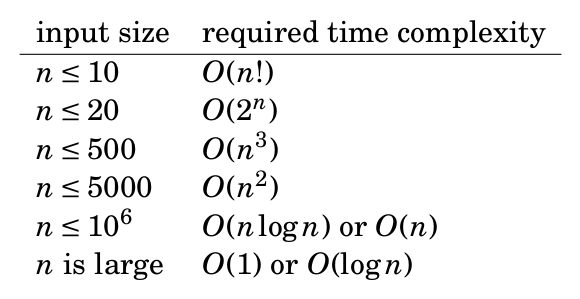

# An Introduction to Time Complexity.

*Prev: [Practice](./3_practice_practice_practice.md)*

Read [Chapter 2: Time Complexity](https://cses.fi/book/book.pdf#page=27).

In basically all CP problems, you can determine from the input size the time complexity intended for the problem. For example, an input size of $2\cdot 10^5$ would mean require a $O(n)$ or $O(\log{n})$ solutions, whereas $n=10^3$ would suggest a quadratic solution.

Because of how costly implementing a wrong/slow algo is, you must think about your algo's time complexity before you implement it in code and make sure it matches the intended time complexity.

You are almost ready to solve the remaining problems! Finish strong by learning about vectors, sets, maps and more in our fifth and last section, [STL library](./5_c++_standard_library.md).
