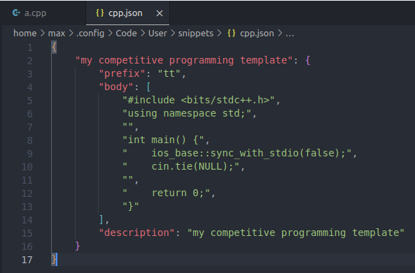

# Visual Studio Code for Competitive Programming

*By Max*

## Why VS Code?

- It can do everything. It's the only code editor I have installed on my computer and I use it for everything, not just competitive programming.
- It's lightweight yet highly customizable with extensions.
- It has an integrated terminal so you don't need your terminal in a separate window.
- It looks nice :D

## Install VS Code

Go to the [official website](https://code.visualstudio.com/download) and follow the appropriate instructions depending on operating system.

## Open Your Folder

I assume you will save all of your programs in some folder on your computer. Open your folder in VS Code by going to `File -> Open Folder...` in the ribbon at the top.

Now all your files and any subdirectories should appear in a tab on the left.

## Compiling and Executing a C++ Program

### Option 1: Just give me a "run" button

Go to the extensions tab in VS Code on the left. It looks like four squares:

Search for and install the [Code Runner](https://marketplace.visualstudio.com/items?itemName=formulahendry.code-runner) extension.

Now you should see a "Run Code" button in the top right corner.

However, if you hit that button, by default the output will appear in the "Output" tab instead of the "Terminal" tab of the window that pops up. And the "Output" window is read-only, so you can't type input in there. To fix this, go to the extension settings of Code Runner. To get there, go back to the extensions tab on the left and click the gear icon next to the Code Runner extension.

Then check the option "Run in Terminal". I also recommend checking "Save File Before Run".

Now go back and hit the "Run Code" button for your program, and its output should appear in a terminal window where you can also type input into.

**Adding Compiler Flags:** If you want to add compiler flags to Code Runner, go back to extension settings and find the "Executor Map" option:

Click "Edit in settings.json" which should bring up a `settings.json` file. You can add your desired compiler flags to the `cpp` entry of `code-runner.executorMap` and save the file. Don't worry about this now/ we will cover it later on.

### Option 2: Terminal

The nice thing about VS Code is the [integrated terminal](https://code.visualstudio.com/docs/terminal/basics). Use `` Ctrl + ` `` to open the terminal. Now you can compile your program there. For example, if your program was named `main.cpp`, then you would compile it with `g++ main.cpp -o main`. Then after compiling, you can run it from the terminal with `./main` (or simply `main` on Windows).

All in one command, you can write it as `g++ main.cpp -o main && ./main`.

Typing the full command out every time can be tedious, so it is recommended that you set up a [build task](https://code.visualstudio.com/docs/languages/cpp) in VS Code.

## Add C++ Intellisense

Coding without some form of [intellisense](https://en.wikipedia.org/wiki/Intelligent_code_completion) or [linter](https://en.wikipedia.org/wiki/Lint_(software)) is a sad life. Let's fix that!

### Easy But Suboptimal Option

Search for and install the [Microsoft C/C++](https://marketplace.visualstudio.com/items?itemName=ms-vscode.cpptools) extension.

Now this should just work out of the box. Your C++ code should now have pretty colors and hovering over lines should bring up related documentation.

The reason I marked this option as suboptimal is because the Microsoft C++ intellisense is kind of bad. The lowest update delay you can set is 500 ms which is not instant and very noticeable, and it often takes longer than that to update. I can type out an entire for loop and it would be completely gray for several seconds before the intellisense catches up.

### My Recommendation: clangd

Search for and install the [clangd](https://marketplace.visualstudio.com/items?itemName=llvm-vs-code-extensions.vscode-clangd) extension.

Upon installation the extension should search for an existing clang installation and automatically install one if no such installation exists. If you've only been following these workshop guides and have not touched C++ beforehand, you should have no clang installation. Just in case the extension doesn't install for you, you can install it from the [LLVM website](https://releases.llvm.org/download.html) and add the path to it in the extension settings.

Now if everything goes smoothly, you will get your pretty colors in your C++ and hovering over lines should bring up related documentation. This should also feel noticeably faster than the Microsoft C++ extension.

However, there is a good chance it won't just work out of the box. Specifically, you may run into issues with include paths (e.g. `#include <bits/stdc++.h>` not working). As the name suggests, clangd uses Clang instead of GCC to compile your program. `#include <bits/stdc++.h>` is a GCC compiler extension and not part of the actual C++ standard, so there is no guarantee that your Clang installation will support it. In case it doesn't, you simply have to add a flag to cross-compile to GCC.

Go to extension settings for clangd and find the "Fallback Flags" option. Add a line of the form `--target=<triple>` to that flag list, where `<triple>` depends on your computer operating system and architecture. Refer to [this link](https://clang.llvm.org/docs/CrossCompilation.html#target-triple) for how to build this `<triple>` string. For example, on my Windows laptop I use `--target=x86_64-w64-windows-gnu` and on my PC I use `--target=x86_64-pc-linux-gnu`. Save your settings changes and reload VS Code once you're done.

**Adding Compiler Flags:** If you want to add compiler flags to clangd, go back to the "Fallback Flags" option under clangd extension settings and add your flags there.

**Remove Annoying Header Include Feature:** When you use the autocomplete feature, clangd will automatically include the necessary header for whatever you just typed. However, sometimes clangd adds a header include even when you already have a different header include that covers it. For example, if you already have `#include <bits/stdc++.h>` which is supposed to cover everything in C++ standard library and you autocomplete an `std::vector`, clangd will still insert `#include <vector>` at the top. To remove this, go to extension settings, find the "Arguments" option, and add `-header-insertion=never` to the list.

## Add Snippets

Sometimes in competitive programming you will repeatedly reuse the same pieces of code. For example, whenever you open a new file, you don't want to retype your template from scratch. You can create a [snippet](https://code.visualstudio.com/docs/editor/userdefinedsnippets) and then type some trigger text to get it to appear. Let's create a snippet for your template!

First, go to [this website](https://snippet-generator.app/) and paste your template in along with a description and "tab trigger", which is the trigger text used to access your snippet. Once you're done, copy the JSON body that appears on the right. Here is an example:

Go back to VS Code and go to `File -> Preferences -> Configure User Snippets` in the ribbon. Select "C++" in the options list that appears, and a file `cpp.json` should pop up. Paste your JSON body into that file **inside the existing curly brackets**. So don't delete the outer curly brackets. The result should look like this:

Now whenever you open a new C++ file, you can type your trigger text and there should be a prompt to autocomplete your template!

