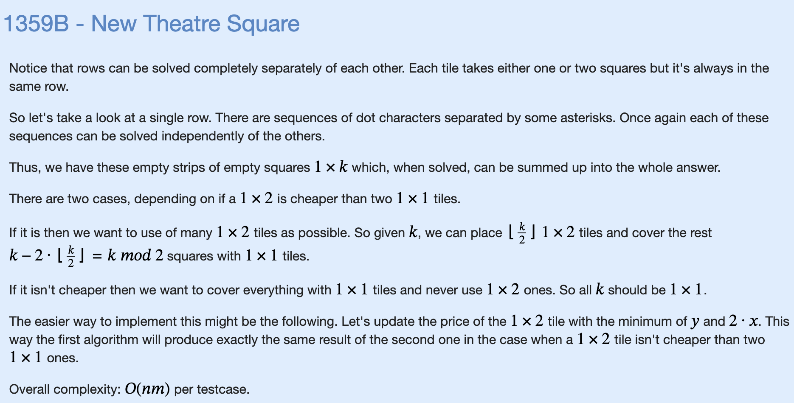
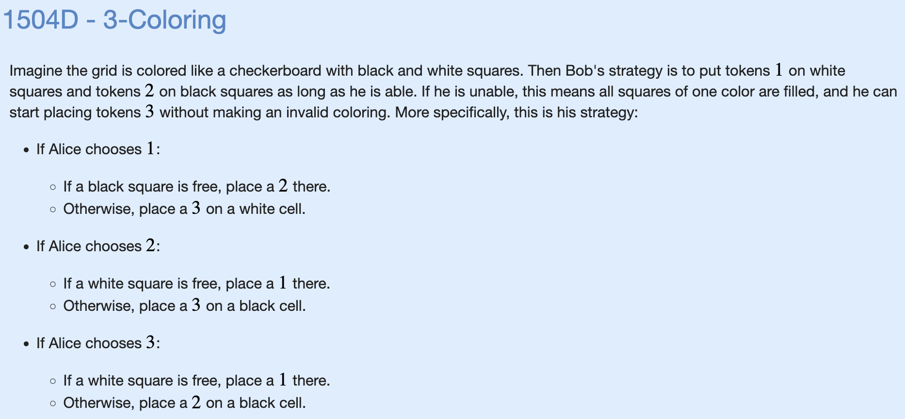

# A: A+B (Trial Problem)

```cpp
#include "bits/stdc++.h"

using namespace std;

void solve() {
    int a,b;
    cin >> a >> b;
    cout << a+b << '\n';
}

int main() {
    int t;
    cin >> t;
    for (int i=0;i<t;i++) {
        solve();
    }
}
```

# B: Little Artem and Presents

We need to make sequence of moves like: 1, 2, 1, 2, ...

So the answer is 2 * n / 3. After that we have either 0, 1 or 2 stones left. If we have 0, we are done, otherwise we have 1 or 2 left, so we only can give 1 more stone.

Final formula is: (2 * n) / 3 + (n % 3 != 0 ? 1 : 0);

```cpp
#include "bits/stdc++.h"

using namespace std;

int main() {
    int n;
    cin >> n;
    int ans = n/3*2 + (n%3>0);
    cout << ans << endl;
}
```

# C: Watermelon

We can always split the watermelon if $n$ is an even integer $>=4$.

```cpp
#include "bits/stdc++.h"

using namespace std;

int main() {
    int n;
    cin >> n;
    if (n%4==0 || (n%2==0 && n>=6)) {
        cout << "YES" << endl;
    } else {
        cout << "NO" << endl;
    }
}
```
# D: Desorting


```cpp
#include "bits/stdc++.h"

using namespace std;

const int MXN = 500;

int a[MXN]; //make arrays global

void solve() {
    int n; cin>> n;
    bool unsorted = false;
    int min_diff = 1e9; // 10^9
    for (int i=0;i<n;i++) {
        cin >> a[i];
        if (i>=1) {
            if (a[i]<a[i-1]) {
                unsorted = true;
            }
            min_diff = min(min_diff, a[i]-a[i-1]);
        }
    }
    if (unsorted) {
        cout << 0 << endl;
        return; // end function early
    }
    // once again floor division
    cout << (min_diff+2)/2 << endl; 
    return;
}
int main() {
    int t;
    cin >> t;
    for (int i=0;i<t;i++) {
        solve();
    }
}
```
# E: Magical Sticks


```cpp
#include "bits/stdc++.h"

using namespace std;

void solve() {
    int n;
    cin >> n;
    cout << (n+1)/2 << endl;
}
int main() {
    int t;
    cin >> t;
    for (int i=0;i<t;i++) {
        solve();
    }
}
```
# F: Maximum GCD


```cpp
#include "bits/stdc++.h"

using namespace std;

void solve() {
    int n;
    cin >> n;
    cout << n/2 << endl;
}
int main() {
    int t;
    cin >> t;
    for (int i=0;i<t;i++) {
        solve();
    }
}
```
# G: Omkar and Completion


```cpp
#include "bits/stdc++.h"

using namespace std;

void solve() {
    int n;
    cin >> n;
    for (int i=0;i<n;i++) {
        // codeforces auto trims the ending " "
        cout << 1 << " ";
    }
    cout << endl;
}

int main() {
    int t;
    cin >> t;
    for (int i=0;i<t;i++) {
        solve();
    }
}
```
# H: 01 Game


```cpp
#include "bits/stdc++.h"

using namespace std;

void solve() {
    string S;
    cin >> S;
    int num_0 = 0, num_1 = 0;
    for (int i=0;i<S.size();i++) {
        if (S[i]=='0') {
            num_0++;
        } else {
            num_1++;
        }
    }
    if (min(num_0,num_1)%2 == 1) {
        cout << "DA" << endl;
    } else {
        cout << "NET" << endl;
    }
}

int main() {
    int t;
    cin >> t;
    for (int i=0;i<t;i++) {
        solve();
    }
}
```
# I: Captain Flint and Crew Recruiting


```cpp
#include "bits/stdc++.h"

using namespace std;

void solve() {
    int n;
    cin >> n;
    if (n >= 31) {
        cout << "YES" << endl;
        int x = n - 30;
        if (x==6 || x==10 || x==14) {
            cout << "15 10 6 " << x-1 << endl;
        } else {
            cout << "14 10 6 " << x << endl;
        }
    } else {
        cout << "NO" << endl;
    }
}

int main() {
    int t;
    cin >> t;
    for (int i=0;i<t;i++) {
        solve();
    }
}
```
# J: LCM Problem


```cpp
#include "bits/stdc++.h"

using namespace std;

void solve() {
    int l,r;
    cin >> l >> r;
    if (2*l <= r) {
        cout << l << " " << 2*l << endl;
    } else {
        cout << "-1 -1" << endl;
    }
}

int main() {
    int t;
    cin >> t;
    for (int i=0;i<t;i++) {
        solve();
    }
}
```
# K: Johny and Ancient Computer


```cpp
#include "bits/stdc++.h"

using namespace std;

void solve() {
    int l,r;
    long long a,b;
    cin >> a >> b;
    if (a > b) {
        // swaps in place
        swap(a,b);
    }
    long long div = b/a;
    int ans = 0;
    while (div>=2 && div%2==0) {
        div /= 2;
        ans++;
    }
    if (div==1 && b%a==0) {
        // ceiling divide
        cout << (ans+2)/3 << '\n';
    } else {
        cout << -1 << '\n';
    }

}

int main() {
    int t;
    cin >> t;
    for (int i=0;i<t;i++) {
        solve();
    }
}
```
# L: Similar Pairs


```cpp
#include "bits/stdc++.h"

using namespace std;

const int MX = 50;

int arr[MX];

void solve() {
    int n;
    cin >> n;
    int num_evens = 0;
    for (int i=0;i<n;i++) {
        cin >> arr[i];
        if (arr[i]%2==0) {
            num_evens++;
        }
    }
    if (num_evens%2 == 0) {
        // just pair all the evens together and all the odds together
        cout << "YES" << endl;
    } else {
        //otherwise it depends on whether we have >=1 pair where |x-y|=1
        sort(arr,arr+n);
        bool flag = false;
        for (int i=1;i<n;i++) {
            if (arr[i] - arr[i-1] == 1) {
                flag = true;
            }
        }
        if (flag) {
            cout << "YES" << endl;
        } else {
            cout << "NO" << endl;
        }

    }

}

int main() {
    int t;
    cin >> t;
    for (int i=0;i<t;i++) {
        solve();
    }
}
```
# M: New Theatre Square



```cpp
#include "bits/stdc++.h"

using namespace std;

const int MX = 101;
const int MX2 = 1001;

bool done[MX][MX2];

void solve() {
    int n,m,x,y;
    cin >> n >> m >> x >> y;
    y = min(2*x, y);
    int cost = 0;
    for (int i=0;i<n;i++) {
        string S; cin >> S;
        for (int j=0;j<m;j++) {
            if (done[i][j] || S[j] == '*') {
                continue;
            }
            if (j!=m-1 && S[j+1]=='.') {
                //try to use a 1x2 block
                done[i][j] = true;
                done[i][j+1] = true;
                cost += y;
                continue;
            }
            cost += x;
        }
    }
    cout << cost << endl;

    for (int i=0;i<n;i++) {
        for (int j=0;j<m;j++) {
            //clear done's for next test case
            done[i][j] = false;
        }
    }
}

int main() {
    int t;
    cin >> t;
    for (int i=0;i<t;i++) {
        solve();
    }
}
```
# N: Berland Poker


```cpp
#include "bits/stdc++.h"

using namespace std;

void solve() {
    int n,m,k;
    cin >> n >> m >> k;
    int hand_size = n/k;
    int my_jokers = min(m, hand_size);
    int rest_jokers = m - my_jokers;
    // divide evenly over rest of k-1 players
    // ceil division of a/b is (a+b-1)/b
    int rest_most = (rest_jokers+k-2)/(k-1);
    cout << my_jokers - rest_most << endl;
}

int main() {
    int t;
    cin >> t;
    for (int i=0;i<t;i++) {
        solve();
    }
}
```
# O: Road to Zero


```cpp
#include "bits/stdc++.h"

using namespace std;

void solve() {
    long long x,y,a,b;
    cin >> x >> y >> a >> b;
    b= min(b,2*a);
    long long cost_decr_both = min(x,y) * b;
    long long cost_decr_larger = abs(x-y) * a;
    cout << cost_decr_both + cost_decr_larger << endl;
}

int main() {
    int t;
    cin >> t;
    for (int i=0;i<t;i++) {
        solve();
    }
}
```
# P: Two Teams Composing


```cpp
#include "bits/stdc++.h"

using namespace std;

void solve() {
    int n; cin >> n;
    map<int,int> m;
    for (int i=0;i<n;i++) {
        int x;cin>>x;
        m[x]++;
    }
    int ans = 1;
    for (pair<int,int> x: m) {
        ans = max(ans, x.second);
    }

    int distinct_nums = m.size();
    if (distinct_nums-1 >= ans) {
        cout << ans << endl;
    } else {
        cout << min(ans-1, distinct_nums) << endl;
    }
}

int main() {
    int t;
    cin >> t;
    for (int i=0;i<t;i++) {
        solve();
    }
}
```
# Q: Middle Class


```cpp
#include "bits/stdc++.h"

using namespace std;

const int MXN = 1e5 + 5;

int arr[MXN];

void solve() {
    int n,x; cin >> n >> x;
    for (int i=0;i<n;i++) {
        cin >> arr[i];
    }
    sort(arr,arr+n);
    reverse(arr, arr+n);
    int ans = 0;
    long long sum = 0;
    for (int i=0;i<n;i++) {
        sum += arr[i];
        if (sum >= (long long) x*(i+1)) {
            ans = i+1;
        } else {
            break;
        }
    }
    cout << ans << endl;
}

int main() {
    int t;
    cin >> t;
    for (int i=0;i<t;i++) {
        solve();
    }
}
```
# R: Kind Anton


```cpp
#include "bits/stdc++.h"

using namespace std;

const int MXN = 1e5 + 5;

int a[MXN], b[MXN];

void solve() {
    int n,x; cin >> n;
    for(int i=0;i<n;i++){
        cin >> a[i];
    }
    for(int i=0;i<n;i++){
        cin >> b[i];
    }
    //find occurence of first +1 and -1
    int first_pos = n, first_neg = n;
    for (int i=n-1;i>=0;i--) {
        if (a[i]==1) {
            first_pos = i;
        }
        if (a[i]==-1) {
            first_neg = i;
        }
    }

    bool works = true;
    for (int i=n-1;i>=0;i--){
        if (a[i]>b[i]) {
            if (first_neg>=i) {
                works = false;
            }
        }
        if (a[i]<b[i]) {
            if (first_pos>=i) {
                works = false;
            }
        }
    }
    cout << (works?"YES":"NO") << endl;
}

int main() {
    int t;
    cin >> t;
    for (int i=0;i<t;i++) {
        solve();
    }
}
```
# S: Sorted Adjance Differences


```cpp
#include "bits/stdc++.h"

using namespace std;

const int MXN = 1e5 + 5;

int arr[MXN];
int ans[MXN];

void solve() {
    int n; cin>>n;
    for (int i=0;i<n;i++) {
        cin >> arr[i];
    }
    sort(arr,arr+n);

    int l=0, r=n-1; // start from the two ends of the arr
    for (int i=0;i<n;i++) {
        if (i%2==0) {
            ans[i] = arr[l];
            l++;
        } else {
            ans[i] = arr[r];
            r--;
        }
    }
    // after reversing, the answer starts from the middle and bounces out
    reverse(ans, ans+n);
    for (int i=0;i<n;i++) {
        cout << ans[i] << " ";
    }
    cout << endl;
}

int main() {
    int t;
    cin >> t;
    for (int i=0;i<t;i++) {
        solve();
    }
}
```
# T: Alternating Subsequence


```cpp
#include "bits/stdc++.h"

using namespace std;

const int MXN = 2e5 + 5;

int arr[MXN];

void solve() {
    int n;
    cin >> n;
    for (int i=0;i<n;i++) {
        cin >> arr[i];
    }
    bool need_pos = (arr[0]>0);
    int lst_num = 0;
    long long sum = 0;
    for (int i=0;i<n;i++) {
        if (arr[i] > 0) {
            if (need_pos) {
                sum += lst_num;
                need_pos = false;
                lst_num = arr[i];
            } else if (arr[i]>lst_num) {
                lst_num = arr[i];
            }
        } else {
            if (!need_pos) {
                sum += lst_num;
                need_pos = true;
                lst_num = arr[i];
            } else if (arr[i]>lst_num) {
                lst_num = arr[i];
            }
        }
    }
    sum += lst_num;
    cout << sum << '\n';

}

int main() {
    int t;
    cin >> t;
    for (int i=0;i<t;i++) {
        solve();
    }
}
```
# U: Ternary String


```cpp
#include "bits/stdc++.h"

using namespace std;

const int MXN = 2e5 + 5;

int arr[MXN];

void solve() {
    string S;
    cin >> S;
    int lst_1=-1, lst_2=-1, lst_3=-1;
    int ans = 1e9;
    for (int i=0;i<S.size();i++) {
        int fst = -1;
        if (S[i]=='1') {
            lst_1 = i;
            fst = min(lst_2,lst_3);
        }
        if (S[i]=='2') {
            lst_2 = i;
            fst = min(lst_1,lst_3);
        }
        if (S[i]=='3') {
            lst_3 = i;
            fst = min(lst_1,lst_2);
        }
        if (fst == -1)
            continue;
        ans = min(ans, i-fst+1);
    }
    cout << (ans == 1e9?0:ans) << endl;

}

int main() {
    int t;
    cin >> t;
    for (int i=0;i<t;i++) {
        solve();
    }
}
```
# V: Anti-Sudoku


```cpp
#include "bits/stdc++.h"

using namespace std;

const int MXN = 9;

int arr[MXN][MXN];

void solve() {
    for (int i=0;i<9;i++) {
        string S;
        cin >> S;
        for (int j=0;j<9;j++) {
            // cute trick to turn characters into ints
            arr[i][j] = S[j] - '0';
        }
    }
    for (int i=0;i<3;i++) {
        for (int j=0;j<3;j++) {
            int &x = arr[3*i+j][3*j+i];
            // see https://cplusplus.com/doc/tutorial/pointers/
            if (x == 1){
                x = 2;
            } else {
                x = 1;
            }

        }
    }

    for (int i=0;i<9;i++) {
        for (int j=0;j<9;j++) {
            cout << arr[i][j];
        }
        cout << '\n';
    }
}

int main() {
    int t;
    cin >> t;
    for (int i=0;i<t;i++) {
        solve();
    }
}
```
# W: Permutation Partitions


```cpp
#include "bits/stdc++.h"

using namespace std;

const int MXN = 2e5+5;
const int MOD = 998244353;

int arr[MXN];

void solve() {
    int n,k;
    cin >> n >> k;
    for (int i=0;i<n;i++) {
        cin >> arr[i];
    }
    long long ways = 1;
    long long sum = 0;
    for (int i=n-k+1;i<=n;i++) {
        sum += i;
    }
    vector<int> v;
    for (int i=0;i<n;i++) {
        if (arr[i] >= n-k+1) {
            //this must be in its own partition
            v.push_back(i);
        }
    }
    for (int i=1;i<v.size();i++) {
        ways = ways * (v[i]-v[i-1]) % MOD;
    }
    cout << sum << " " << ways << endl;
}

int main() {
    int t=1;
    // cin >> t;
    for (int i=0;i<t;i++) {
        solve();
    }
}
```
# X: Balance the Bits


```cpp
#include "bits/stdc++.h"

using namespace std;

const int MXN = 2e5+5;

char r1[MXN], r2[MXN];

bool works (string x) {
    int cnt = 0;
    for (int i=0;i<x.size();i++) {
        if (x[i]=='(') {
            cnt++;
        } else {
            cnt--;
            if (cnt<0) {
                return false;
            }
        }
    }
    return cnt == 0;
}

void solve() {
    int n; cin >> n;
    string S; cin >> S;
    int cnt_ones = 0;
    for (int i=0;i<n;i++) {
        if (S[i]=='1') {
            cnt_ones++;
        }
    }
    if (cnt_ones%2 == 1) {
        cout << "NO" << endl;
        return;
    }
    cnt_ones -= cnt_ones/2; // assign just first half as (
    bool flag = false;
    for (int i=0;i<n;i++) {
        if (S[i]=='1') {
            if (cnt_ones>0){
                r1[i] = '(';
                r2[i] = '(';
            } else {
                r1[i] = ')';
                r2[i] = ')';
            }
            cnt_ones--;
        } else {
            if (flag) {
                r1[i] = '(';
                r2[i] = ')';
            } else {
                r1[i] = ')';
                r2[i] = '(';
            }
            flag = !flag;
        }
    }
    string s1(r1), s2(r2);
    if (works(s1) && works(s2)) {
        cout << "YES" << endl;
        cout << s1 << '\n';
        cout << s2 << '\n';
    } else {
        cout << "NO" << endl;
    }

    for (int i=0;i<n;i++) {
        r1[i] = '\0'; //null char
        r2[i] = '\0';
    }

}

int main() {
    int t=1;
    cin >> t;
    for (int i=0;i<t;i++) {
        solve();
    }
}
```
# Y: 3-Coloring



```cpp
#include "bits/stdc++.h"

using namespace std;

// see https://cplusplus.com/reference/utility/pair/pair/
vector<pair<int,int> > parity[2];

void solve() {
    int n;
    cin >> n;
    for (int i=0;i<n;i++) {
        for (int j=0;j<n;j++) {
            // you should probably use {i,j} instead of make_pair{i,j}
            parity[(i+j)%2].push_back(make_pair(i+1,j+1));
        }
    }
    for (int i=0;i<n*n;i++) {
        int x;cin>>x;
        if (x == 1) {
            if (parity[1].size()) {
                int val = 2;
                int row = parity[1].back().first;
                int col = parity[1].back().second;
                cout << val << " " << row << " " << col << endl;
                parity[1].pop_back();
            } else {
                int val = 3;
                int row = parity[0].back().first;
                int col = parity[0].back().second;
                cout << val << " " << row << " " << col << endl;
                parity[0].pop_back();
            }
        } else if (x == 2) {
            if (parity[0].size()) {
                int val = 1;
                int row = parity[0].back().first;
                int col = parity[0].back().second;
                cout << val << " " << row << " " << col << endl;
                parity[0].pop_back();
            } else {
                int val = 3;
                int row = parity[1].back().first;
                int col = parity[1].back().second;
                cout << val << " " << row << " " << col << endl;
                parity[1].pop_back();
            }
        } else {
            for (int j=0;j<2;j++) {
                if (parity[j].size()) {
                    int val = j+1;
                    int row = parity[j].back().first;
                    int col = parity[j].back().second;
                    cout << val << " " << row << " " << col << endl;
                    parity[j].pop_back();
                    break;
                }
            }
        }
        cout.flush();
    }
}

int main() {
    int t=1;
    // cin >> t;
    for (int i=0;i<t;i++) {
        solve();
    }
}
```
# Z: Nezzar and Board


```cpp
#include "bits/stdc++.h"

using namespace std;

const int MXN = 2e5+5;

long long gcd(long long a, long long b) {
    if (b == 0) {
        return a;
    }
    return gcd(b, a % b);
}

void solve() {
    long long n,k;
    cin >> n >> k;
    vector<long long> v(n);
    for (int i=0;i<n;i++) {
        cin >> v[i];
    }
    long long ans = abs(v[1]-v[0]);
    for (int i=1;i<n;i++) {
        ans = gcd(ans, abs(v[i]-v[0]));
        // built in gcd function
        // O(logn) with euclidean algo
    }
    if (abs(k-v[0])%ans==0) {
        cout << "YES" << endl;
    } else {
        cout << "NO" << endl;
    }
}

int main() {
    int t=1;
    cin >> t;
    for (int i=0;i<t;i++) {
        solve();
    }
}
```
