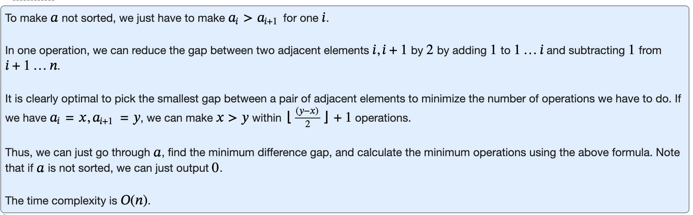

# D: Desorting



```cpp
#include "bits/stdc++.h"

using namespace std;

const int MXN = 500;

int a[MXN]; //make arrays global

void solve() {
    int n; cin>> n;
    bool unsorted = false;
    int min_diff = 1e9; // 10^9
    for (int i=0;i<n;i++) {
        cin >> a[i];
        if (i>=1) {
            if (a[i]<a[i-1]) {
                unsorted = true;
            }
            min_diff = min(min_diff, a[i]-a[i-1]);
        }
    }
    if (unsorted) {
        cout << 0 << endl;
        return; // end function early
    }
    // once again floor division
    cout << (min_diff+2)/2 << endl; 
    return;
}
int main() {
    int t;
    cin >> t;
    for (int i=0;i<t;i++) {
        solve();
    }
}
```