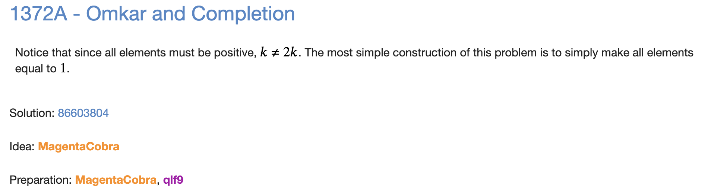

# G: Omkar and Completion



```cpp
#include "bits/stdc++.h"

using namespace std;

void solve() {
    int n;
    cin >> n;
    for (int i=0;i<n;i++) {
        // codeforces auto trims the ending " "
        cout << 1 << " ";
    }
    cout << endl;
}

int main() {
    int t;
    cin >> t;
    for (int i=0;i<t;i++) {
        solve();
    }
}
```