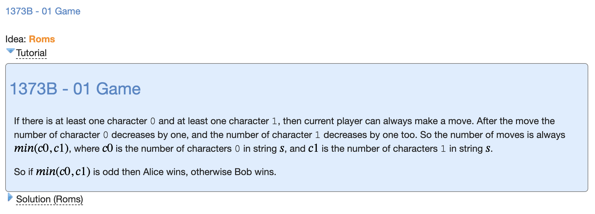

# H: 01 Game



```cpp
#include "bits/stdc++.h"

using namespace std;

void solve() {
    string S;
    cin >> S;
    int num_0 = 0, num_1 = 0;
    for (int i=0;i<S.size();i++) {
        if (S[i]=='0') {
            num_0++;
        } else {
            num_1++;
        }
    }
    if (min(num_0,num_1)%2 == 1) {
        cout << "DA" << '\n';
    } else {
        cout << "NET" << '\n';
    }
}

int main() {
    ios_base::sync_with_stdio(false);
    cin.tie(NULL);

    int t;
    cin >> t;
    for (int i=0;i<t;i++) {
        solve();
    }
}
```