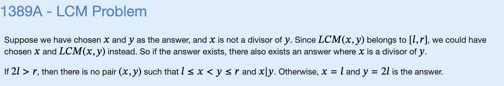

# J: LCM Problem



```cpp
#include "bits/stdc++.h"

using namespace std;

void solve() {
    int l,r;
    cin >> l >> r;
    if (2*l <= r) {
        cout << l << " " << 2*l << '\n';
    } else {
        cout << "-1 -1" << '\n';
    }
}

int main() {
    ios_base::sync_with_stdio(false);
    cin.tie(NULL);

    int t;
    cin >> t;
    for (int i=0;i<t;i++) {
        solve();
    }
}
```