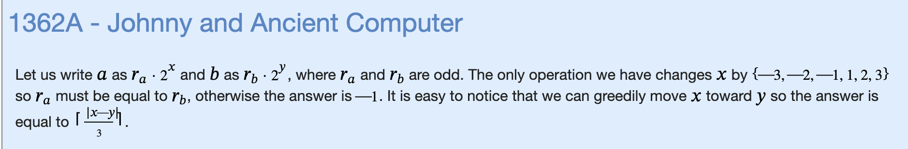

# K: Johny and Ancient Computer



```cpp
#include "bits/stdc++.h"

using namespace std;

void solve() {
    int l,r;
    long long a,b;
    cin >> a >> b;
    if (a > b) {
        // swaps in place
        swap(a,b);
    }
    long long div = b/a;
    int ans = 0;
    while (div>=2 && div%2==0) {
        div /= 2;
        ans++;
    }
    if (div==1 && b%a==0) {
        // ceiling divide
        cout << (ans+2)/3 << '\n';
    } else {
        cout << -1 << '\n';
    }

}

int main() {
    ios_base::sync_with_stdio(false);
    cin.tie(NULL);

    int t;
    cin >> t;
    for (int i=0;i<t;i++) {
        solve();
    }
}
```