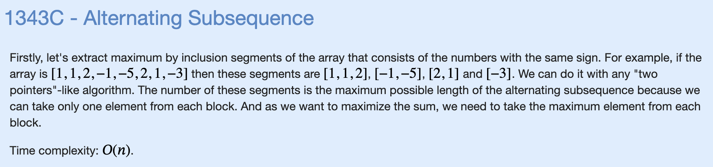

# T: Alternating Subsequence



```cpp
#include "bits/stdc++.h"

using namespace std;

const int MXN = 2e5 + 5;

int arr[MXN];

void solve() {
    int n;
    cin >> n;
    for (int i=0;i<n;i++) {
        cin >> arr[i];
    }
    bool need_pos = (arr[0]>0);
    int lst_num = 0;
    long long sum = 0;
    for (int i=0;i<n;i++) {
        if (arr[i] > 0) {
            if (need_pos) {
                sum += lst_num;
                need_pos = false;
                lst_num = arr[i];
            } else if (arr[i]>lst_num) {
                lst_num = arr[i];
            }
        } else {
            if (!need_pos) {
                sum += lst_num;
                need_pos = true;
                lst_num = arr[i];
            } else if (arr[i]>lst_num) {
                lst_num = arr[i];
            }
        }
    }
    sum += lst_num;
    cout << sum << '\n';

}

int main() {
    ios_base::sync_with_stdio(false);
    cin.tie(NULL);

    int t;
    cin >> t;
    for (int i=0;i<t;i++) {
        solve();
    }
}
```