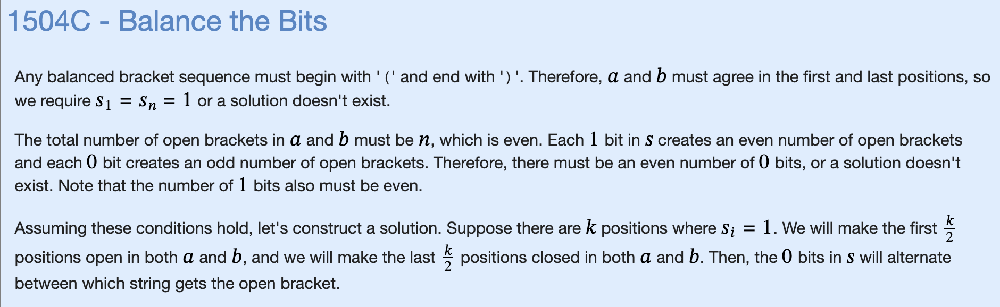

# X: Balance the Bits



```cpp
#include "bits/stdc++.h"

using namespace std;

const int MXN = 2e5+5;

char r1[MXN], r2[MXN];

bool works (string x) {
    int cnt = 0;
    for (int i=0;i<x.size();i++) {
        if (x[i]=='(') {
            cnt++;
        } else {
            cnt--;
            if (cnt<0) {
                return false;
            }
        }
    }
    return cnt == 0;
}

void solve() {
    int n; cin >> n;
    string S; cin >> S;
    int cnt_ones = 0;
    for (int i=0;i<n;i++) {
        if (S[i]=='1') {
            cnt_ones++;
        }
    }
    if (cnt_ones%2 == 1) {
        cout << "NO" << endl;
        return;
    }
    cnt_ones -= cnt_ones/2; // assign just first half as (
    bool flag = false;
    for (int i=0;i<n;i++) {
        if (S[i]=='1') {
            if (cnt_ones>0){
                r1[i] = '(';
                r2[i] = '(';
            } else {
                r1[i] = ')';
                r2[i] = ')';
            }
            cnt_ones--;
        } else {
            if (flag) {
                r1[i] = '(';
                r2[i] = ')';
            } else {
                r1[i] = ')';
                r2[i] = '(';
            }
            flag = !flag;
        }
    }
    string s1(r1), s2(r2);
    if (works(s1) && works(s2)) {
        cout << "YES" << endl;
        cout << s1 << '\n';
        cout << s2 << '\n';
    } else {
        cout << "NO" << endl;
    }

    for (int i=0;i<n;i++) {
        r1[i] = '\0'; //null char
        r2[i] = '\0';
    }

}

int main() {
    int t=1;
    cin >> t;
    for (int i=0;i<t;i++) {
        solve();
    }
}
```