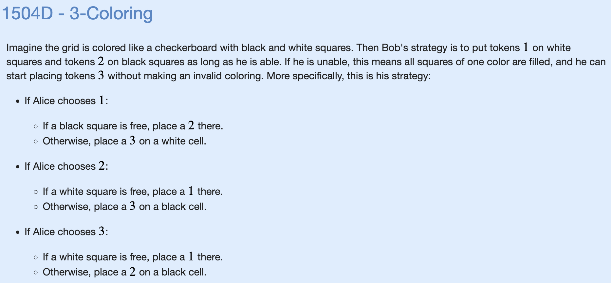

# Y: 3-Coloring



```cpp
#include "bits/stdc++.h"

using namespace std;

// see https://cplusplus.com/reference/utility/pair/pair/
vector<pair<int,int> > parity[2];

void solve() {
    int n;
    cin >> n;
    for (int i=0;i<n;i++) {
        for (int j=0;j<n;j++) {
            // you should probably use {i,j} instead of make_pair{i,j}
            parity[(i+j)%2].push_back(make_pair(i+1,j+1));
        }
    }
    for (int i=0;i<n*n;i++) {
        int x;cin>>x;
        if (x == 1) {
            if (parity[1].size()) {
                int val = 2;
                int row = parity[1].back().first;
                int col = parity[1].back().second;
                cout << val << " " << row << " " << col << '\n';
                parity[1].pop_back();
            } else {
                int val = 3;
                int row = parity[0].back().first;
                int col = parity[0].back().second;
                cout << val << " " << row << " " << col << '\n';
                parity[0].pop_back();
            }
        } else if (x == 2) {
            if (parity[0].size()) {
                int val = 1;
                int row = parity[0].back().first;
                int col = parity[0].back().second;
                cout << val << " " << row << " " << col << '\n';
                parity[0].pop_back();
            } else {
                int val = 3;
                int row = parity[1].back().first;
                int col = parity[1].back().second;
                cout << val << " " << row << " " << col << '\n';
                parity[1].pop_back();
            }
        } else {
            for (int j=0;j<2;j++) {
                if (parity[j].size()) {
                    int val = j+1;
                    int row = parity[j].back().first;
                    int col = parity[j].back().second;
                    cout << val << " " << row << " " << col << '\n';
                    parity[j].pop_back();
                    break;
                }
            }
        }
        cout.flush();
    }
}

int main() {
    ios_base::sync_with_stdio(false);
    cin.tie(NULL);

    int t=1;
    // cin >> t;
    for (int i=0;i<t;i++) {
        solve();
    }
}
```