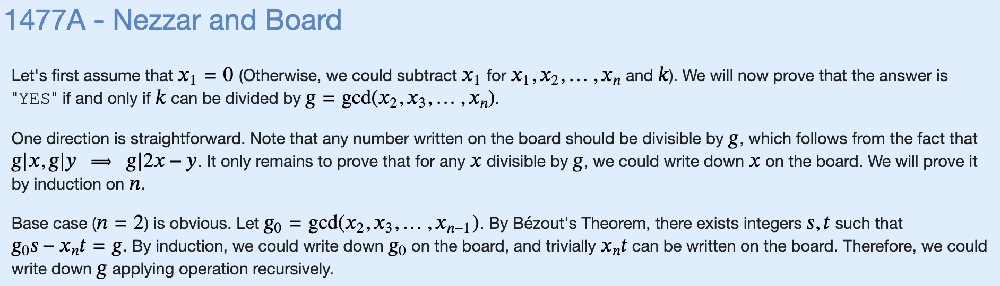

# Z: Nezzar and Board



```cpp
#include "bits/stdc++.h"

using namespace std;

const int MXN = 2e5+5;

long long gcd(long long a, long long b) {
    if (b == 0) {
        return a;
    }
    return gcd(b, a % b);
}

void solve() {
    long long n,k;
    cin >> n >> k;
    vector<long long> v(n);
    for (int i=0;i<n;i++) {
        cin >> v[i];
    }
    long long ans = abs(v[1]-v[0]);
    for (int i=1;i<n;i++) {
        ans = gcd(ans, abs(v[i]-v[0]));
        // built in gcd function
        // O(logn) with euclidean algo
    }
    if (abs(k-v[0])%ans==0) {
        cout << "YES" << '\n';
    } else {
        cout << "NO" << '\n';
    }
}

int main() {
    ios_base::sync_with_stdio(false);
    cin.tie(NULL);

    int t=1;
    cin >> t;
    for (int i=0;i<t;i++) {
        solve();
    }
}
```